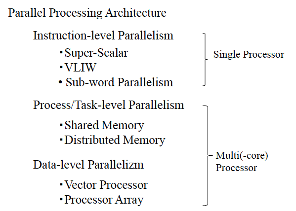
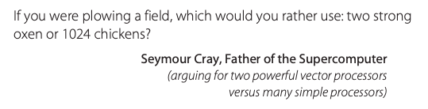
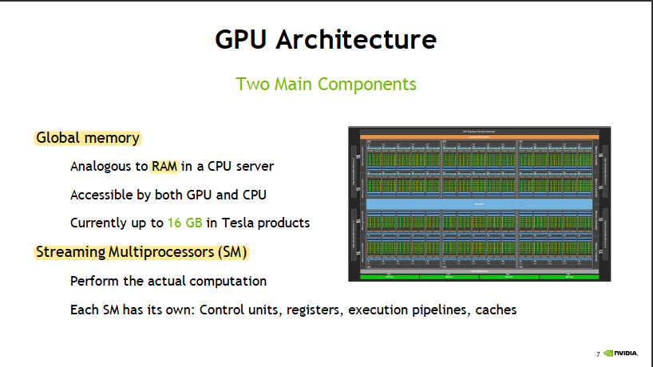
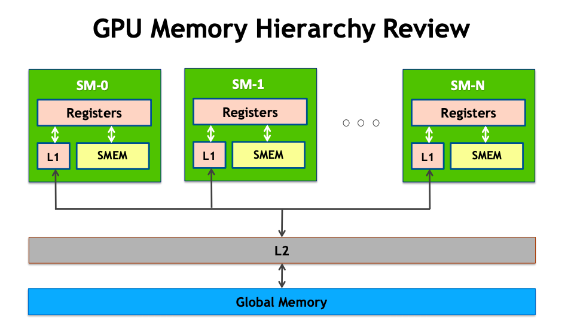
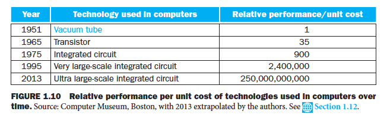

# [Computer Architecture: Quantitative Approach 5th Edition](http://uni-site.ir/khuelec/wp-content/uploads/Computer-Architecture-A-Quantitative-Approach.pdf)
## Chapter 4. Data-Level Parallelism in Vector, SIMD, and GPU Architectures 

**data parallel algorithms**:  simultaneous operations across large sets of data  
* desirable for any kind of tightly-coupled parallel or vector machine
* map nested parallelism onto a flat parallel machine  
**multiple threads of control**  
in most applications there is significantly more data-parallelism available than control parallelism.  

**single instruction, multiple data (SIMD) architecture**  
think sequentially yet achieves parallel speedup by having parallel data operations.  
>The most efficient way to execute a vectorizable application is a vector processor. 
vector programs strive to keep memory busy.  
**multiple instruction multiple data (MIMD)**  

# Computer Organization & Design: The Hardware/Software Interface, 5th Edition

## 8 Great Ideas

### Moore’s Law 
resources available per chip  
“up and to the right” Moore’s Law graph ↗️  
### Abstraction 
use abstractions to represent the design at **different levels of representation**  
### Make the Common Case Fast 
### Performance via Parallelism 
### Pipelining
A prevalent pattern of parallelism  
**human chain** to carry a water
source to fire v.s. **individuals running back and forth**  
### Prediction  
### Hierarchy of Memories
caches give illusion: main memory nearly **as fast as the top** of the hierarchy, **as big and cheap as the bottom** of the hierarchy  
### Dependability via Redundancy
any physical device can fail 

## Underlyings

### Software: High-Level Language ➡️ Assembly Language ➡️ Binary Machine Language
compiler(编译器) assembler(汇编器)  
domain-specific languages  
independent of the computer: compilers and assemblers can translate  

### Hardware:(five classic components) input, output, memory, __datapath__, __control__ (__processer__) 
#### inputting data
#### outputting data
#### processing data
#### storing data
**volatile memory: main memory, primary memory**  
DRAM  
**nonvolatile memory: secondary memory**  
disk  
flash memory: wear out aft er 100,000 to 1,000,000 writes  

### Communication
Ethernet: local area network (LAN)  
Internet: wide area network (WAN)

### Technologies for Building Processors and Memory

conductors, insulators, switches  

#### Performance
response time  
throughput  

